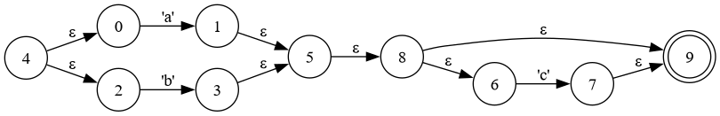
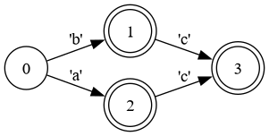
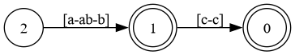

# Regez
Experimental regex to C compiler.

## How it works
The first pass converts the regular expression into a nondeterministic finite automaton (NFA). The second pass applies the Subset Construction algorithm to make the automaton deterministic (DFA). Afterward, it attempts to merge neighboring characters into ranges, such as converting `a|b` into `[a-b]`. Finally, the last pass converts the DFA into a C file.

## How to use it

```sh
cargo run --release -- "(a|b)c?" > test.c
# You can run the example main or use the test.h api
gcc main.c test.c -o tester
./tester "ab"
```

## Debug it

If you have graphviz installed you can generate images of each stage of processing using the `-d` flag.

```sh
cargo run --release -- -d "(a|b)c?"
```





## Issues

- There is a problem with some intersecting ranges (eg: [a-z] and [b-z]) that has to be fixed
- The generated C program returns true if there are others characters at the end of a match.
